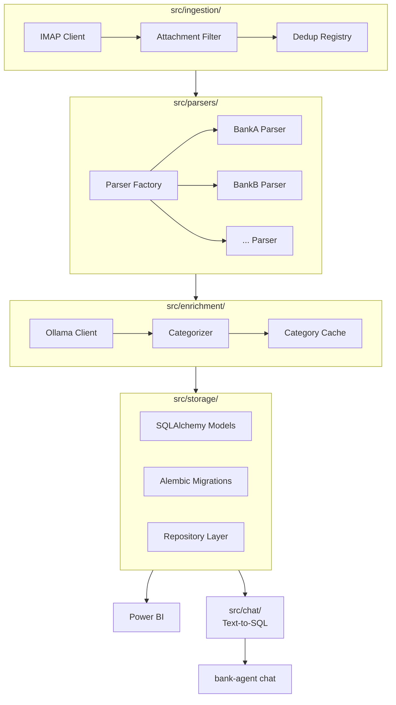

# CLAUDE.md

Read this file completely before touching any code. It is the authoritative reference for any AI agent working on this repository.

---

## What this project does

**bank-agent-llm** is a local-first Python library and CLI tool that:
1. Fetches bank statement attachments from one or more IMAP email accounts
2. Detects the bank and parses each statement using the appropriate parser (Factory pattern)
3. Normalizes all transactions into a single SQLite/PostgreSQL database
4. Categorizes raw transaction descriptions using a local LLM via Ollama
5. Exposes the data for Power BI dashboards and a natural-language CLI chat interface

All processing is local. No financial data reaches any external API.

---

## Architecture



---

## Module responsibilities

| Module | Responsibility |
|--------|---------------|
| `pipeline.py` | Public library API — orchestrates all stages |
| `cli.py` | CLI entry point — thin wrapper over `Pipeline` |
| `ingestion/` | IMAP connection, attachment download, deduplication |
| `parsers/` | `BankParser` base class, `ParserFactory`, one file per bank |
| `enrichment/` | Ollama HTTP client, batch categorization, caching |
| `storage/` | SQLAlchemy models, Alembic migrations, repository classes |
| `chat/` | Text-to-SQL using Ollama — schema injection, query execution |

---

## Technology stack

| Concern | Library | Why |
|---------|---------|-----|
| CLI | `typer` + `rich` | Type-safe commands, beautiful terminal output |
| Config | `pydantic-settings` v2 | Typed config, reads YAML + env vars |
| Email | `imapclient` | Clean IMAP API over stdlib `imaplib` |
| PDF | `pdfplumber` | Best-in-class tabular extraction from PDFs |
| Spreadsheet | `openpyxl` | Excel/XLSX support |
| ORM | `sqlalchemy` 2.x | Modern, type-safe ORM |
| Migrations | `alembic` | Schema versioning |
| LLM | `httpx` → Ollama REST API | Direct, no framework overhead |
| Resilience | `tenacity` | Retries for IMAP and Ollama calls |
| Packaging | `uv` + `hatchling` | Fast installs, PEP 517 build |
| Testing | `pytest` + `pytest-httpx` | Mock httpx calls without monkey-patching |
| Linting | `ruff` | Linter + formatter in one |
| Types | `mypy` strict | Full type coverage |

---

## CLI commands

```
bank-agent run            Full pipeline
bank-agent fetch          Email ingestion only
bank-agent parse          Parse downloaded files only
bank-agent enrich         Categorise transactions only
bank-agent status         DB summary
bank-agent chat           Natural-language query session
bank-agent config-check   Validate config.yaml
bank-agent db migrate     Run Alembic migrations
bank-agent db reset       Drop and recreate DB (destructive)
bank-agent --version      Print version
```

---

## Adding a new bank parser

1. Create `src/bank_agent_llm/parsers/<bank_slug>.py` extending `BankParser`
2. Implement `bank_name`, `can_parse()`, and `parse()`
3. Register in `src/bank_agent_llm/parsers/factory.py`
4. Add anonymized sample to `tests/fixtures/`
5. Write tests in `tests/parsers/test_<bank_slug>.py`

Full guide: `docs/adding-a-parser.md`

---

## Branch and commit conventions

| Branch | Purpose |
|--------|---------|
| `main` | Stable releases — merge from `develop` at milestone close only |
| `develop` | Integration branch |
| `feature/<name>` | New functionality |
| `fix/<name>` | Bug fixes |
| `docs/<name>` | Documentation only |
| `chore/<name>` | Tooling, deps, config |

Commit format: `type: short description` — types: `feat fix docs chore test refactor`

---

## Configuration

Config lives in `config/config.yaml` (gitignored). Template: `config/config.example.yaml`.
All values readable from environment variables. Code accesses config only via `src/bank_agent_llm/config.py` using Pydantic Settings — never read files or env vars directly in business logic.

---

## Database

- All DB access through the repository layer (`src/storage/`)
- Schema changes via Alembic only — never alter tables manually
- Deduplication enforced by unique constraint: `(account_id, date, amount, description_hash)`

---

## What NOT to do

- Do not commit `config/config.yaml`, `.env`, or any file containing credentials
- Do not put business logic in `cli.py` — it belongs in `pipeline.py` or a module
- Do not call Ollama directly outside `src/enrichment/` and `src/chat/`
- Do not modify an existing parser to add a new bank — always add a new file
- Do not bypass Alembic to change the schema
- Do not use `print()` — use `logging` in library code, `rich` in CLI code
- Do not store PDFs in git — they belong in `data/raw/` (gitignored)

---

*Update this file when a new module is added, a dependency changes, or an architectural decision is made.*
