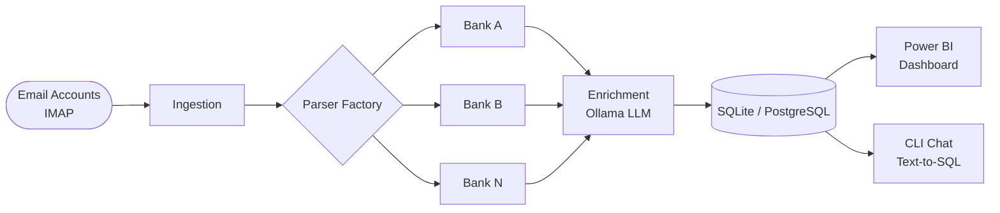

# bank-agent-llm

Local-first, AI-powered pipeline for personal financial intelligence. Fetches bank statements from email, parses them across bank formats, categorizes transactions with a local LLM, and surfaces the data via Power BI dashboards and a natural-language CLI.

**All processing is 100% local — financial data never leaves the machine.**

---

## Pipeline



---

## Features

- Connects to multiple IMAP email accounts simultaneously
- Auto-detects bank format and routes to the correct parser (Factory pattern)
- Normalizes transactions from any bank into a single schema
- Categorizes raw transaction descriptions using a local Ollama model
- Incrementally updates — only processes new statements on each run
- Power BI dashboard ready via direct SQLite/PostgreSQL connection
- Natural-language chat over your transaction history (`bank-agent chat`)
- Usable as a CLI tool or as a Python library

---

## CLI

```
bank-agent run            Full pipeline: fetch → parse → enrich → store
bank-agent fetch          Download new statements from email accounts
bank-agent parse          Parse downloaded statement files
bank-agent enrich         Categorise transactions via Ollama
bank-agent status         Show database summary
bank-agent chat           Interactive natural-language query session
bank-agent config-check   Validate configuration file
bank-agent db migrate     Apply pending database migrations
bank-agent db reset       Drop and recreate the database
bank-agent --version      Show version
```

---

## As a Library

```python
from bank_agent_llm import Pipeline

pipeline = Pipeline(config_path="config/config.yaml")
pipeline.run()

# Or run individual stages:
pipeline.fetch()
pipeline.parse()
pipeline.enrich()
```

---

## Quick Start

**Prerequisites:** Python 3.11+, [Ollama](https://ollama.ai) running locally.

```bash
git clone https://github.com/JuanLara18/bank-agent-llm.git
cd bank-agent-llm

pip install uv
uv sync

cp config/config.example.yaml config/config.yaml
# Fill in email credentials and Ollama settings

bank-agent db migrate
bank-agent run
```

---

## Supported Banks

| Bank | Status |
|------|--------|
| *(first parser — M3)* | Planned |

Adding a bank requires one file. See [docs/adding-a-parser.md](docs/adding-a-parser.md).

---

## Project Status

**M1: Foundation** — in progress. See [docs/roadmap.md](docs/roadmap.md).

---

## License

MIT
