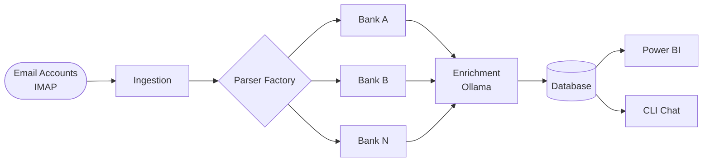
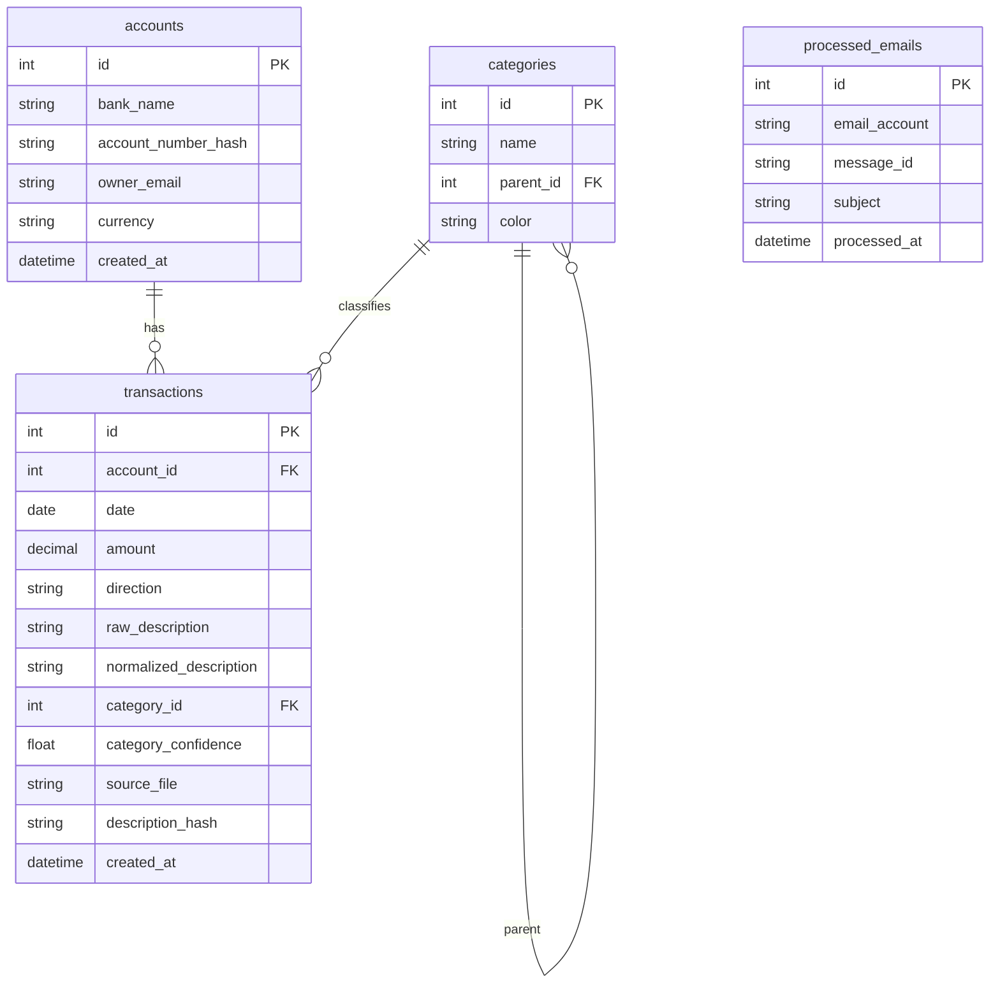
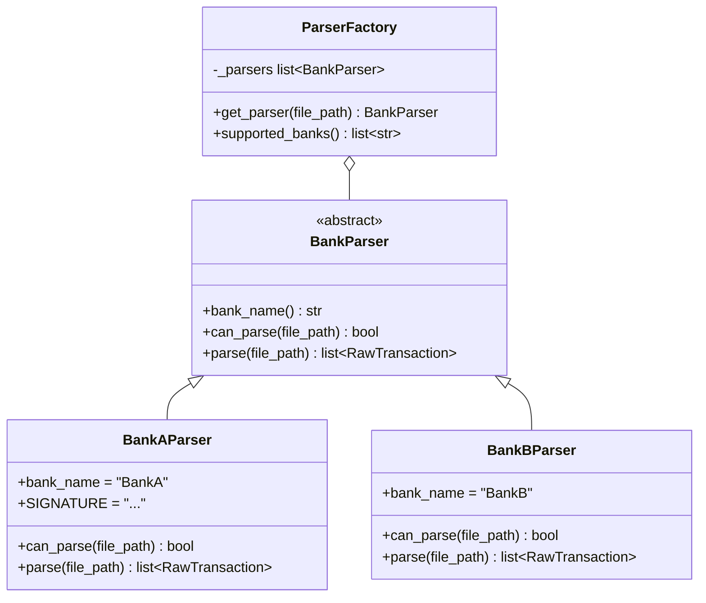
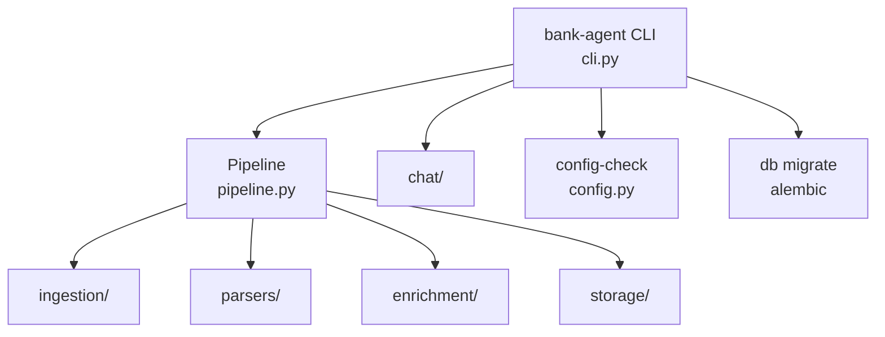

# Architecture

## Pipeline overview

## Layer detail

```mermaid
flowchart TD
    subgraph ing["Ingestion — src/ingestion/"]
        direction LR
        IC[IMAP Client] --> AF[Attachment Filter]
        AF --> DR[Dedup Registry]
        DR --> FS[data/raw/]
    end

    subgraph par["Parsers — src/parsers/"]
        direction LR
        PF[ParserFactory\nget_parser&#40;file&#41;] --> BA[BankA Parser]
        PF --> BB[BankB Parser]
        PF --> BN[... Parser]
    end

    subgraph enr["Enrichment — src/enrichment/"]
        direction LR
        OC[Ollama Client] --> CAT[Categorizer]
        CAT --> CC[Category Cache\navoid re-calling LLM]
    end

    subgraph sto["Storage — src/storage/"]
        direction LR
        MOD[SQLAlchemy Models] --- REP[Repository Layer]
        MIG[Alembic Migrations] --> MOD
    end

    ing --> par
    par --> enr
    enr --> sto
```

## Data model

## Parser pattern

## CLI architecture

The CLI is a thin layer. Every command delegates immediately to `Pipeline` or a module. This keeps the library usable independently of the CLI.

## Architectural decisions

### SQLite as default database
Zero setup for new users. Power BI connects via ODBC. Switchable to PostgreSQL via one config line.

### Direct Ollama API over LangChain
Fewer dependencies, full control over prompts, no framework abstractions between the LLM call and the code.

### imapclient over stdlib imaplib
`imapclient` provides a clean, Pythonic API with proper connection management. `imaplib` is verbose and error-prone for multi-folder, multi-account setups.

### tenacity for retries
Both IMAP connections and Ollama calls are network operations that can transiently fail. `tenacity` handles exponential backoff with one decorator — no manual retry loops.

### pdfplumber as primary PDF library
Handles multi-column, tabular PDF layouts (common in bank statements) far better than PyPDF2, which is limited to simple text extraction.
