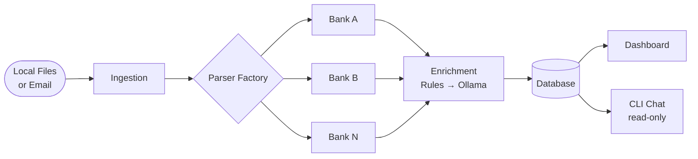
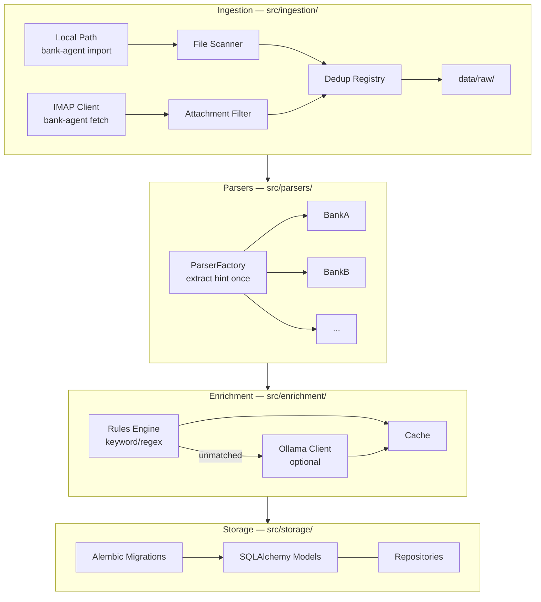
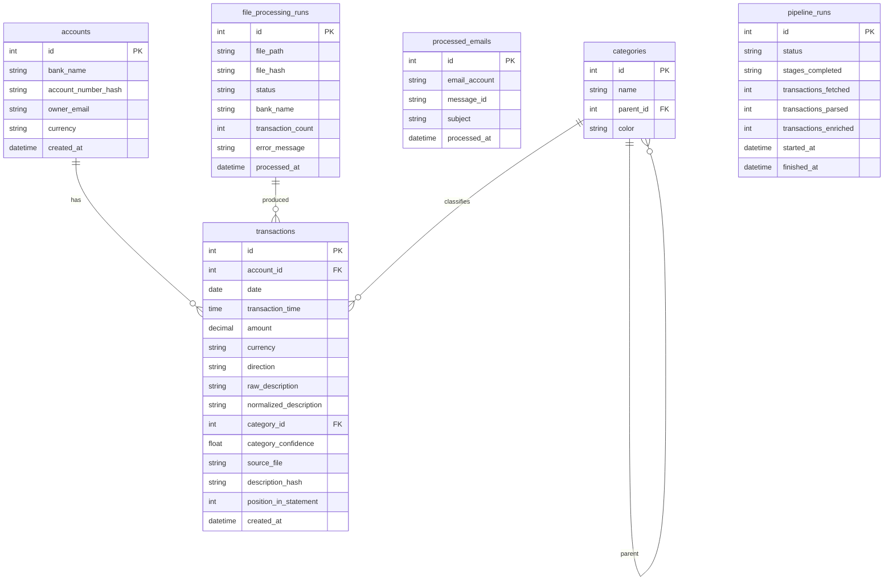
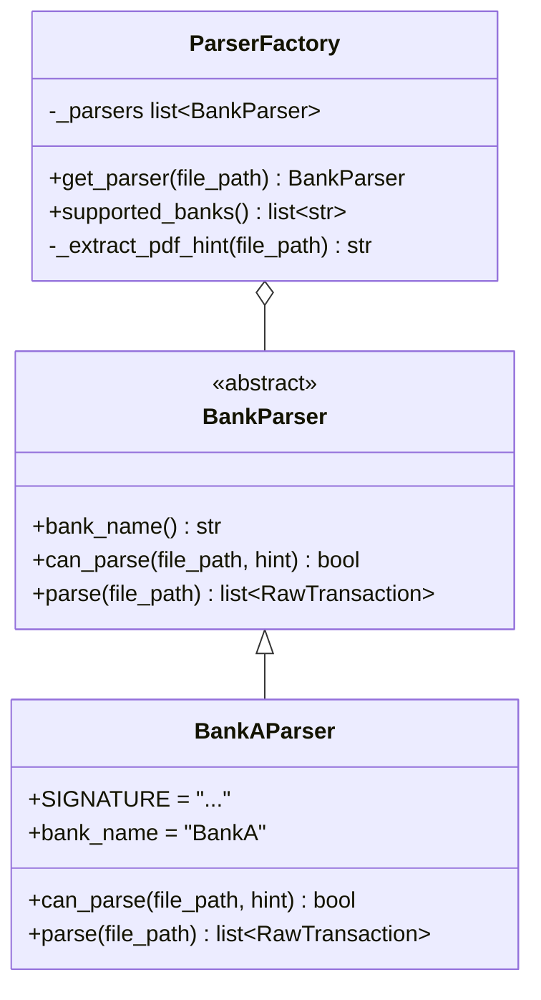
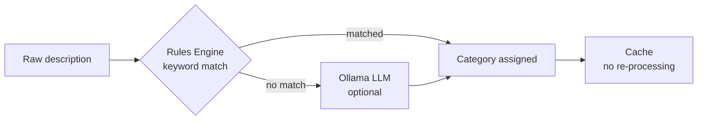
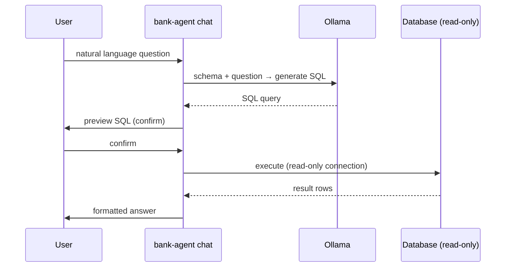

# Architecture

## Pipeline overview

## Layer detail

## Data model

**Deduplication:** unique constraint on `(account_id, date, amount, description_hash, position_in_statement)`. The `position_in_statement` discriminator handles identical transactions on the same day (e.g. two coffee purchases) where amount and description are the same.

## Parser pattern

`ParserFactory` extracts the PDF first-page text **once per file** and passes it as `hint` to every `can_parse()` call. With N parsers and M files the cost is M PDF opens, not N×M.

## Categorization tiers

Ollama is **optional**. If not available, transactions unmatched by the rules engine remain uncategorized and can be reviewed via `bank-agent status`. Rules are defined in `config.yaml` and cover the majority of repeat transactions (same 20 merchants = 80% of spend).

## Chat — read-only safety

The chat interface always connects with a read-only SQLAlchemy URL. LLM-generated SQL is shown to the user before execution.

## Architectural decisions

### SQLite as default database
Zero setup. Power BI connects via ODBC. Switchable to PostgreSQL with one config line.

### Direct Ollama API over LangChain
Fewer dependencies, full prompt control, no framework abstractions between the LLM call and the code.

### imapclient over stdlib imaplib
Cleaner API with proper connection management. `imaplib` is verbose and error-prone for multi-folder, multi-account setups.

### tenacity for retries
Both IMAP and Ollama are network operations prone to transient failure. `tenacity` handles exponential backoff with one decorator.

### pdfplumber as primary PDF library
Handles multi-column tabular layouts (common in bank statements) far better than PyPDF2.

### Config env-var interpolation
`pydantic-settings` does not expand `${ENV_VAR}` tokens inside YAML files natively — PyYAML loads them as literal strings. The config loader in `src/bank_agent_llm/config.py` calls `os.path.expandvars` on the raw YAML string before passing it to the YAML parser. Secrets are stored in `.env` and loaded via `python-dotenv` before config parsing.

### Tiered categorization (rules first, LLM fallback)
LLMs are slow and non-deterministic for high-volume classification. A keyword/regex rules engine handles the predictable majority of transactions instantly and for free. Ollama is invoked only for descriptions that no rule matches, making it optional infrastructure rather than a hard dependency.
