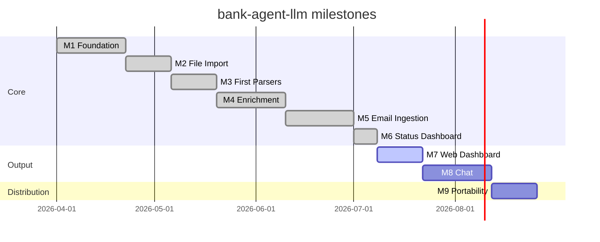

# Roadmap

Each milestone produces a working, testable slice of the system with at least one usable CLI command.

---

## M1 — Foundation ✅

**Goal:** Installable project with working CLI skeleton, config validation, and database infrastructure.

**CLI commands:** `bank-agent --version`, `bank-agent config-check`, `bank-agent db migrate`, `bank-agent db reset`

- [x] Git repo, branch strategy, CLAUDE.md
- [x] `pyproject.toml` with all dependencies declared
- [x] `src/` package structure with `py.typed` marker
- [x] `Pipeline` class (public library API)
- [x] CLI skeleton with Typer — all commands stubbed
- [x] `BankParser` abstract base class with `hint` param
- [x] `ParserFactory` with hint optimization and `UnsupportedBankError`
- [x] Pydantic Settings + `os.path.expandvars` YAML loader
- [x] SQLAlchemy models: `Account`, `Transaction`, `Category`, `ProcessedEmail`, `FileProcessingRun`, `PipelineRun`, `MerchantCache`
- [x] Repository layer per model + Alembic migrations (001, 002)
- [x] Unit tests for config, repository, factory

---

## M2 — File Import ✅

**Goal:** Parse statement files from a local path. Primary ingestion method — no email required.

**CLI commands:** `bank-agent import <path>`

- [x] `src/ingestion/file_scanner.py` — recursively find `.pdf` and `.xlsx` files
- [x] `src/ingestion/dedup.py` — SHA-256 hash deduplication via `file_processing_runs`
- [x] `Pipeline.import_files(path)` — scan → dedup → parse → store
- [x] `bank-agent import <path>` with Rich output table
- [x] Unit tests for scanner and dedup

---

## M3 — First Parsers ✅

**Goal:** Parse real bank statements end-to-end and store transactions.

**Banks supported:** Bancolombia (VISA + Mastercard), Falabella CMR, Scotiabank Colpatria / DaviBank

- [x] `src/parsers/bancolombia.py` — handles triple-encoded PDF text, extracts card number
- [x] `src/parsers/falabella.py` — handles double-encoded text, stops at savings section
- [x] `src/parsers/scotiabank.py` — two-section parser (pagos + transacciones)
- [x] All parsers registered in `ParserFactory`
- [x] Password-protected PDF support (`pdf_passwords` in config)
- [x] Anonymized fixture PDFs in `tests/fixtures/`
- [x] Integration tests per parser

**Known limitations:**
- Bancolombia "Comisiones Consolidadas" annual report is detected but yields 0 transactions (it's a cost summary, not a transaction list — correct behavior)
- No transaction timestamp available in any PDF — banks only publish date

---

## M4 — Enrichment ✅

**Goal:** Auto-categorize transactions. Rules engine first, Ollama optional fallback.

**CLI commands:** `bank-agent enrich [--force]`

- [x] Tag taxonomy (`src/enrichment/data/tags.yaml`) — two-level hierarchy, `is_expense` flag
- [x] Keyword rules (`src/enrichment/data/rules.yaml`) — ~70 rules covering Colombian merchants
- [x] `src/enrichment/tags.py` — `TagTaxonomy` with parent/leaf resolution
- [x] `src/enrichment/rules.py` — `SignatureRules` engine (direction + keyword matching)
- [x] `src/enrichment/ollama.py` — batch client (15 tx/call), structured JSON output, retries
- [x] `src/enrichment/enricher.py` — orchestrates rules → merchant cache → LLM
- [x] `MerchantCache` table — avoids re-calling LLM for known descriptions
- [x] `tag_source` field: `pending | keyword_rule | direction_rule | llm | llm_cache | manual`
- [x] Idempotent: already-tagged transactions excluded at SQL level
- [x] **Real data coverage: 279/281 transactions tagged by rules (99.3%)**
- [x] User-overridable rules via `config/categories.yaml`
- [x] Unit + integration tests (48 tests)

**Tags taxonomy:**
`comida` (restaurante, supermercado, tienda, domicilio) · `transporte` (uber, parqueadero, gasolina, taxi) · `entretenimiento` (streaming, bar, eventos) · `tech` (software, telefonia) · `hogar` (servicios-publicos, internet-tv, mercado) · `salud` (farmacia, medico, seguro) · `deporte` (gym, tienda-deportiva) · `banco` (intereses, cuota-manejo, seguro-bancario, impuesto-gmf, comisiones) · `pago-tarjeta` · `transferencia` · `ingreso` · `cancelada`

---

## M5 — Email Ingestion ✅

**Goal:** Automatically download new statements from email accounts.

**CLI commands:** `bank-agent fetch [--discover]`

- [x] `src/ingestion/gmail_client.py` — Gmail API OAuth2 client
  - First run: opens browser for authorization, saves token to `config/gmail_token.json`
  - Subsequent runs: uses saved token (auto-refreshed)
  - `--discover` mode: scans patterns without downloading
  - Searches from configurable year (default: 2022)
- [x] `src/ingestion/imap_client.py` — generic IMAP client with tenacity retries
  - Used for Outlook and any non-Gmail accounts
- [x] `Pipeline.fetch(discover=False)` — routes Gmail accounts to API, others to IMAP
- [x] `ProcessedEmailRepository` — tracks message IDs to avoid re-downloading
- [x] `python-dotenv` added; `.env` loaded automatically at CLI startup

**Configured accounts:**
- `jlara@unal.edu.co` (Gmail) — OAuth2, no password needed
- `larajuand@outlook.com` — IMAP + App Password (`EMAIL_OUTLOOK_PASS` in `.env`)

**Setup:**
1. `config/gmail_credentials.json` — OAuth2 client secrets from Google Cloud Console
2. `config/gmail_token.json` — auto-generated after first authorization (gitignored)
3. `.env` — `EMAIL_OUTLOOK_PASS`, `PDF_PASSWORD_1`, `PDF_PASSWORD_2`

---

## M6 — Status Dashboard ✅

**Goal:** Terminal dashboard showing financial summary of all transactions.

**CLI commands:** `bank-agent status [--top N]`

- [x] `StatsRepository` — analytics queries (monthly trend, top tags, top merchants, day-of-week)
- [x] `bank-agent status` — Rich panels: resumen general, por cuenta, top categorías, top comercios, tendencia mensual, gasto por día de semana
- [x] `bank-agent db purge --before <date>` — delete old transactions

**Real data results (Oct 2025 – Mar 2026, 281 transactions):**
- Gasto total: ~$33M COP (incl. Ampliaciones de Plazo)
- Top gasto real: Uber/Didi 141 viajes · Cursor+Coursera $2.7M · Restaurantes $1.4M
- Día de mayor gasto: Jueves (distorsionado por Ampliaciones de Plazo en Oct 2025)

---

## M7 — Web Dashboard 🔜

**Goal:** Visual financial reports in a browser. Accessible to any user on any OS.

**CLI commands:** `bank-agent dashboard`

- [ ] Streamlit web dashboard (`bank-agent dashboard` command)
  - Monthly income vs expenses chart
  - Spending by category (pie / bar)
  - Top merchants
  - Running balance timeline
  - Date range filter, account filter
  - Tag drill-down (click category → see transactions)
- [ ] `docs/powerbi.md` — optional Power BI guide (SQLite ODBC + sample `.pbix`)

---

## M8 — Chat Interface 🔜

**Goal:** Natural-language queries over transaction history from the terminal.

**CLI commands:** `bank-agent chat`

- [ ] `src/chat/schema_inspector.py` — introspect DB schema for prompt injection
- [ ] `src/chat/text_to_sql.py` — build SQL from natural language via Ollama; read-only connection
- [ ] `src/chat/session.py` — multi-turn conversation with history
- [ ] SQL preview shown before execution — never runs without confirmation
- [ ] `bank-agent chat` REPL with Rich formatting
- [ ] Unit tests with mocked Ollama and in-memory DB

**Requires:** Ollama running locally (`ollama pull mistral:7b && ollama serve`)

---

## M9 — Portability 🔜

**Goal:** Clone and run in under 10 minutes.

- [ ] `docker-compose.yml` — app container + Ollama sidecar
- [ ] `Makefile` targets: `setup`, `run`, `test`, `lint`
- [ ] `docs/setup.md` — complete setup walkthrough for new users
- [ ] `docs/extending.md` — register custom parsers from outside the repo
- [ ] `CHANGELOG.md` — semver changelog
- [ ] GitHub release workflow

---

## Decisions & constraints

- **No transaction timestamps** — Colombian bank PDFs only publish date (DD/MM/YYYY), not time. Hour-of-day analysis requires a different data source (banking app API or push notifications).
- **Ollama is optional** — rules engine handles 99%+ of known Colombian merchants. LLM only needed for truly unknown descriptions.
- **SQLite by default** — zero setup, works with Power BI via ODBC. Switch to PostgreSQL by changing `database.url` in config.
- **PDF passwords** — Colombian banks encrypt PDFs with the account holder's cédula. Store in `.env` as `PDF_PASSWORD_1`, `PDF_PASSWORD_2`.
- **Gmail OAuth2** — institutional Google Workspace accounts (e.g. `@unal.edu.co`) can't use App Passwords; OAuth2 via Gmail API is required.
