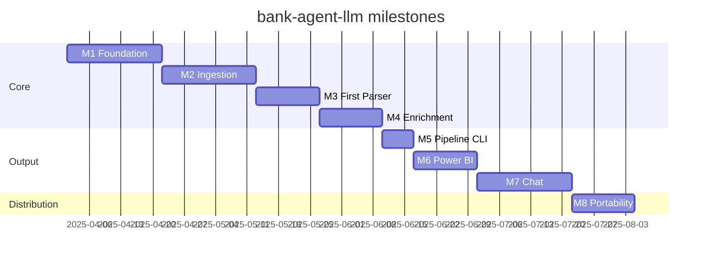

# Roadmap

Each milestone produces a working, testable slice of the system. Milestones map to GitHub Milestones; individual items map to Issues.

---

## M1 — Foundation

**Goal:** A fully scaffolded, installable project with a working CLI skeleton and database infrastructure. No pipeline logic yet.

**CLI commands delivered:** `bank-agent --version`, `bank-agent --help`, `bank-agent config-check`, `bank-agent db migrate`, `bank-agent db reset`

- [x] Git repo, branch strategy, CLAUDE.md
- [x] `pyproject.toml` with all dependencies
- [x] `src/` package structure with `py.typed` marker
- [x] `Pipeline` class (public library API)
- [x] CLI skeleton with Typer (`cli.py`)
- [x] `BankParser` abstract base class
- [x] `ParserFactory` with `UnsupportedBankError`
- [x] `ParserFactory` unit tests
- [x] GitHub Actions CI (lint + type check + tests)
- [x] Issue and PR templates
- [ ] `src/bank_agent_llm/config.py` — Pydantic Settings reading `config/config.yaml` + `.env`
- [ ] `bank-agent config-check` implemented
- [ ] `src/storage/models.py` — SQLAlchemy models: `Account`, `Transaction`, `Category`, `ProcessedEmail`
- [ ] `src/storage/repository.py` — repository classes per model
- [ ] First Alembic migration (`001_initial_schema`)
- [ ] `bank-agent db migrate` implemented
- [ ] `bank-agent db reset` implemented
- [ ] Unit tests for config validation
- [ ] Unit tests for repository layer (in-memory SQLite)

---

## M2 — Ingestion

**Goal:** Connect to real email accounts and download statement attachments incrementally.

**CLI commands delivered:** `bank-agent fetch`

- [ ] `src/ingestion/imap_client.py` — `IMAPClient` wrapping `imapclient` with `tenacity` retries
- [ ] `src/ingestion/attachment_filter.py` — filter by extension, sender domain, subject keywords
- [ ] `src/ingestion/dedup.py` — check `processed_emails` table before downloading
- [ ] `src/ingestion/downloader.py` — save attachments to `data/raw/<account>/<date>/`
- [ ] `bank-agent fetch` implemented end-to-end
- [ ] Unit tests with mocked `imapclient` session
- [ ] Integration test against a local IMAP server (Greenmail or similar)

---

## M3 — First Parser

**Goal:** Parse one real bank's statements end-to-end and store transactions in the DB.

**CLI commands delivered:** `bank-agent parse`

- [ ] Choose first bank (based on available statement samples)
- [ ] `src/parsers/<bank_slug>.py` — concrete parser with `can_parse()` and `parse()`
- [ ] Registered in `ParserFactory`
- [ ] `bank-agent parse` implemented — processes all files in `data/raw/`, stores to DB
- [ ] Anonymized sample PDF in `tests/fixtures/`
- [ ] Integration test: parse fixture → assert expected transactions in DB

---

## M4 — Enrichment

**Goal:** Auto-categorize every transaction description using a local Ollama model.

**CLI commands delivered:** `bank-agent enrich`

- [ ] `src/enrichment/ollama_client.py` — thin `httpx` wrapper over Ollama REST API with `tenacity`
- [ ] `src/enrichment/categorizer.py` — batch categorization, category prompt template
- [ ] `src/enrichment/cache.py` — skip already-categorized descriptions
- [ ] Category taxonomy configurable in `config.yaml`
- [ ] `bank-agent enrich` implemented
- [ ] Unit tests with `pytest-httpx` mocking Ollama responses
- [ ] Confidence score stored per transaction

---

## M5 — Full Pipeline CLI

**Goal:** End-to-end `bank-agent run` command and a `bank-agent status` dashboard in the terminal.

**CLI commands delivered:** `bank-agent run`, `bank-agent status`

- [ ] `Pipeline.run()` wires up M2 + M3 + M4 in sequence
- [ ] `bank-agent run` with `--no-fetch`, `--no-enrich` flags
- [ ] `bank-agent status` — Rich table showing: accounts, date range, transaction count, top categories, uncategorized count
- [ ] End-to-end integration test: fetch mock → parse fixture → enrich mock → assert DB state
- [ ] `docs/setup.md` — full setup walkthrough

---

## M6 — Power BI

**Goal:** A published Power BI report connected to the local database.

- [ ] SQLite ODBC connection guide in `docs/powerbi.md`
- [ ] PostgreSQL DirectQuery connection guide
- [ ] Sample `.pbix` file with views:
  - Monthly income vs expenses
  - Spending by category (donut + trend)
  - Top merchants
  - Per-account breakdown
  - Running balance timeline

---

## M7 — Chat Interface

**Goal:** Ask questions about transactions in natural language from the terminal.

**CLI commands delivered:** `bank-agent chat`

- [ ] `src/chat/schema_inspector.py` — introspect DB schema for prompt injection
- [ ] `src/chat/text_to_sql.py` — build SQL from natural language using Ollama
- [ ] `src/chat/session.py` — multi-turn conversation with history
- [ ] `bank-agent chat` — interactive REPL with Rich formatting
- [ ] Example queries documented in `docs/chat.md`
- [ ] Unit tests with mocked Ollama and in-memory DB

---

## M8 — Portability

**Goal:** Anyone can clone and run in under 10 minutes. Package publishable to PyPI.

- [ ] `docker-compose.yml` — app container + Ollama sidecar
- [ ] `Makefile` with targets: `setup`, `run`, `test`, `lint`
- [ ] `docs/setup.md` — complete onboarding guide
- [ ] Config validation with user-friendly error messages (not stack traces)
- [ ] `CHANGELOG.md` — semver changelog
- [ ] `pyproject.toml` ready for `uv publish` / PyPI release
- [ ] GitHub release workflow (`.github/workflows/release.yml`)
- [ ] `docs/extending.md` — how to register custom parsers from outside the repo
