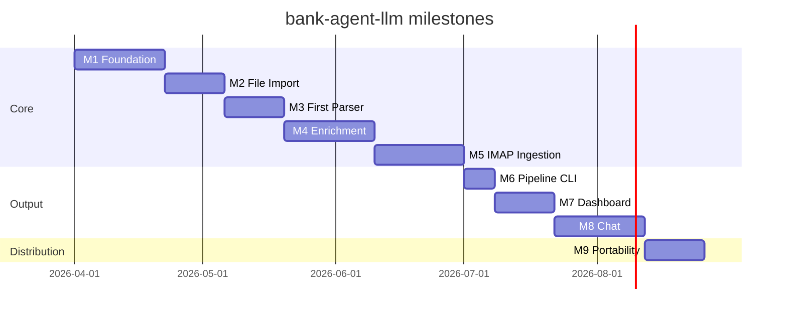

# Roadmap

Each milestone produces a working, testable slice of the system with at least one usable CLI command. Milestones map to GitHub Milestones; individual items map to Issues.

---

## M1 — Foundation

**Goal:** Installable project with a working CLI skeleton, config validation, and database infrastructure. No pipeline logic yet.

**CLI commands delivered:** `bank-agent --version`, `bank-agent --help`, `bank-agent config-check`, `bank-agent db migrate`, `bank-agent db reset`

- [x] Git repo, branch strategy, CLAUDE.md
- [x] `pyproject.toml` with all dependencies declared
- [x] `src/` package structure with `py.typed` marker
- [x] `Pipeline` class (public library API with all method stubs)
- [x] CLI skeleton with Typer — all commands stubbed
- [x] `BankParser` abstract base class with `hint` param and `position_in_statement`
- [x] `ParserFactory` with hint optimization and `UnsupportedBankError`
- [x] `ParserFactory` unit tests
- [x] GitHub Actions CI (lint + type check + tests on every PR)
- [x] Issue and PR templates
- [x] `src/bank_agent_llm/config.py` — Pydantic Settings + `os.path.expandvars` YAML loader
- [x] `bank-agent config-check` — validates config and reports errors clearly (no stack traces)
- [x] `src/storage/models.py` — SQLAlchemy models: `Account`, `Transaction`, `Category`, `ProcessedEmail`, `FileProcessingRun`, `PipelineRun`
- [x] `src/storage/repository.py` — repository class per model
- [x] First Alembic migration (`001_initial_schema`)
- [x] `bank-agent db migrate` and `bank-agent db reset` implemented
- [x] Unit tests for config validation
- [x] Unit tests for repository layer (in-memory SQLite)

---

## M2 — File Import

**Goal:** Parse statement files from a local path. No email required. This is the primary and simplest ingestion path.

**CLI commands delivered:** `bank-agent import <path>`

- [ ] `src/ingestion/file_scanner.py` — recursively find `.pdf` and `.xlsx` files in a directory
- [ ] `src/ingestion/dedup.py` — check `file_processing_runs` table before re-parsing a file (by SHA-256 hash)
- [ ] `Pipeline.import_files(path)` wired end-to-end: scan → dedup → parse → enrich → store
- [ ] `bank-agent import <path>` implemented
- [ ] Unit tests for file scanner and dedup logic

---

## M3 — First Parser

**Goal:** Parse one real bank's statements end-to-end and store transactions in the DB.

- [ ] Choose first bank (based on available statement samples — open an Issue with the bank name)
- [ ] `src/parsers/<bank_slug>.py` — concrete parser implementing `can_parse()` and `parse()`
- [ ] Registered in `ParserFactory`
- [ ] Anonymized sample PDF in `tests/fixtures/`
- [ ] Integration test: parse fixture → assert expected transactions in DB

---

## M4 — Enrichment

**Goal:** Auto-categorize transactions. Ollama is optional — the rules engine runs first.

**CLI commands delivered:** `bank-agent enrich`

- [ ] `src/enrichment/rules_engine.py` — keyword/regex rules loaded from `config.yaml`; handles ~80% of transactions at zero LLM cost
- [ ] `src/enrichment/ollama_client.py` — `httpx` wrapper over Ollama REST API with `tenacity` retries
- [ ] `src/enrichment/categorizer.py` — runs rules engine first, falls back to Ollama for unmatched descriptions
- [ ] `src/enrichment/cache.py` — skip already-categorized raw descriptions
- [ ] `bank-agent enrich` implemented
- [ ] Ollama dependency is **optional**: if not running, rules-engine-only mode works without error
- [ ] Unit tests with `pytest-httpx` mocking Ollama responses
- [ ] Confidence score stored per transaction

---

## M5 — IMAP Ingestion

**Goal:** Automatically download new statements from email accounts.

**CLI commands delivered:** `bank-agent fetch`

- [ ] `src/ingestion/imap_client.py` — `IMAPClient` wrapping `imapclient` with `tenacity` retries
- [ ] OAuth2 authentication support for Gmail and Outlook (app-password fallback documented)
- [ ] `src/ingestion/attachment_filter.py` — filter by extension, sender domain, subject keywords
- [ ] `src/ingestion/email_dedup.py` — check `processed_emails` table before downloading
- [ ] `bank-agent fetch` implemented end-to-end
- [ ] Unit tests with mocked `imapclient` session

---

## M6 — Full Pipeline CLI

**Goal:** End-to-end `bank-agent run` command and a `bank-agent status` terminal dashboard.

**CLI commands delivered:** `bank-agent run`, `bank-agent status`

- [ ] `Pipeline.run()` wires M2 + M3 + M4 (import → parse → enrich)
- [ ] `bank-agent run` with `--no-fetch`, `--no-enrich` flags
- [ ] `bank-agent status` — Rich table showing: accounts, date range, transaction count, top categories, uncategorized count, last pipeline run
- [ ] `PipelineRun` tracking in DB — each run records stages, counts, status
- [ ] `bank-agent db purge --before <date>` implemented
- [ ] End-to-end integration test: import fixture → parse → enrich mock → assert DB state
- [ ] `docs/setup.md` — complete setup walkthrough

---

## M7 — Dashboard

**Goal:** Visual financial reports accessible to any user on any OS.

- [ ] `bank-agent status --rich` — expanded terminal dashboard with Rich panels (income vs expenses, top categories, monthly trend, per-account breakdown)
- [ ] Optional Streamlit web dashboard (`bank-agent dashboard` command)
  - Monthly income vs expenses
  - Spending by category
  - Top merchants
  - Running balance timeline
  - Date range and account filters
- [ ] `docs/powerbi.md` — optional Power BI guide for Windows users (SQLite ODBC + sample `.pbix`)

---

## M8 — Chat Interface

**Goal:** Natural-language queries over transaction history from the terminal.

**CLI commands delivered:** `bank-agent chat`

- [ ] `src/chat/schema_inspector.py` — introspect DB schema for prompt injection
- [ ] `src/chat/text_to_sql.py` — build SQL from natural language using Ollama; always uses a read-only connection
- [ ] `src/chat/session.py` — multi-turn conversation with history
- [ ] SQL preview shown to user before execution — never runs without confirmation
- [ ] `bank-agent chat` REPL with Rich formatting
- [ ] `docs/chat.md` — example queries and limitations
- [ ] Unit tests with mocked Ollama and in-memory DB

---

## M9 — Portability

**Goal:** Clone and run in under 10 minutes. Distributable via Docker.

- [ ] `docker-compose.yml` — app container + Ollama sidecar
- [ ] `Makefile` targets: `setup`, `run`, `test`, `lint`
- [ ] Config validation with user-friendly error messages (no stack traces for missing fields)
- [ ] `docs/extending.md` — register custom parsers from outside the repo (plugin pattern)
- [ ] `CHANGELOG.md` — semver changelog
- [ ] GitHub release workflow (`.github/workflows/release.yml`)
- [ ] README install instructions verified end-to-end on clean machine
